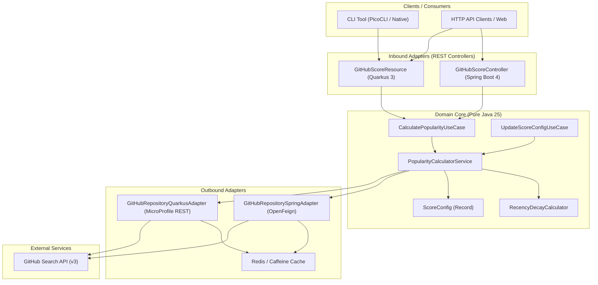

# 🚀 GitHub Repository Popularity Scorer (`alns-rcpharm-ghrepos-scorer`)

> A production-ready, highly resilient microservice and CLI application built with **Java 25** and **Hexagonal Architecture**. It evaluates and ranks GitHub repositories using a custom decay-weighted popularity scoring algorithm, featuring dual Web runners (**Spring Boot 4** and **Quarkus 3**) and a native GraalVM CLI.

---

## 🤖 AI-Assisted Engineering & Spec-Driven Development (SDD)

This project was engineered leveraging **Google Antigravity (AGY)** powered by **Gemini** models, adhering to a **Spec-Driven Development (SDD)** paradigm from initial architecture to final deployment manifests.

### 🎯 How AI Agents & SDD Were Leveraged:
1. **Spec-First Engineering**:
   - Technical specifications, domain models, and architectural boundaries were established prior to implementation.
   - The AI agent operated under strict constraints: pure Java 25 domain model with zero framework dependencies, Hexagonal Ports & Adapters, RFC 5988 Link header pagination, and explicit error handling contracts.

2. **Iterative Autonomous Cycles**:
   - Implementation progressed through structured, test-verified cycles: `domain-core` calculation logic $\rightarrow$ `services-springboot` adapter $\rightarrow$ `services-quarkus` adapter $\rightarrow$ `util-cli` GraalVM native binary $\rightarrow$ Docker & Kubernetes infrastructure.
   - Every phase was empirically validated through automated unit tests (`JUnit 5`, `AssertJ`) and integration tests (`Testcontainers Redis`, `WireMock`).

3. **Software Craftsmanship & Ownership**:
   - AI served as a powerful force multiplier for boilerplate, cross-framework wiring (Spring Cloud Feign vs Quarkus MicroProfile REST Client), and GraalVM native configuration.
   - All architectural decisions (Hexagonal boundaries, two-tier caching, async cache warming, RFC 7807 ProblemDetails) remain fully understood, documented, and justified.

---

## 📐 Architecture & Module Design

The project strictly follows **Hexagonal Architecture (Ports & Adapters)** to decouple core business logic from framework dependencies.

```text
alns-rcpharm-ghrepos-scorer/
├── ghreposscorer-domain-core          # 100% Pure Java 25 Domain (Zero framework dependencies)
├── ghreposscorer-services-springboot  # Spring Boot 4 Runner (OpenFeign, Resilience4j, Spring Cache, OpenAPI)
├── ghreposscorer-services-quarkus     # Quarkus 3 Runner (RESTEasy Reactive, SmallRye Fault Tolerance, OpenAPI)
├── ghreposscorer-util-cli             # PicoCLI Native Binary (Reuses Quarkus infrastructure)
└── k8s/                               # Kubernetes Manifests (Scoped under namespace alns-rcpharm-ghrepos-scorer)
```

### 🗺️ System Architecture Diagram



---

## 💡 Engineering Trade-Offs & Design Rationale

> *"Implementing software is always about trade-offs... balancing between clarity and getting-things-done."*

### 1. Hexagonal Architecture (Ports & Adapters)
- **Trade-off:** Requires explicit separation between core domain interfaces (Ports) and infrastructure implementations (Adapters), increasing initial file count.
- **Rationale:** Ensures `domain-core` has **zero external dependencies** (no Spring, Quarkus, or Jakarta annotations). Core scoring rules can be tested in milliseconds without booting a Spring context or CDI container.

### 2. Dual Microservice Runners (Spring Boot 4 vs Quarkus 3)
- **Trade-off:** Maintaining configuration parity across two distinct frameworks.
- **Rationale:** 
  - **Spring Boot 4:** Ideal for enterprise ecosystems with widespread OpenFeign and Resilience4j support.
  - **Quarkus 3:** Delivers sub-second startup (~10ms) and minimal RAM footprint (~35MB), enabling instant native compilation via GraalVM for the PicoCLI runner.

### 3. Caching Strategy & Async Cache Warming
- **Trade-off:** Stale cache risks vs API rate limits.
- **Rationale:** GitHub search API allows only 10 requests/minute unauthenticated (30 req/min authenticated). We employ a two-tier caching mechanism (Caffeine in-memory + Redis distributed cache). When scoring parameters are updated (`PUT /api/v1/config/scoring`), cache is invalidated and a background `ManagedExecutor` asynchronously warms cache entries non-blocking.

### 4. RFC 5988 Link Header Pagination & Delay Safeguards
- **Trade-off:** Sequential HTTP round-trips vs API rate throttling.
- **Rationale:** Instead of hardcoding page numbers, adapters follow the standard `rel="next"` URI sent by GitHub's `Link` header up to `maxPagesToFetch`. A configurable delay (`delayBetweenGHApiRequestsMillis`) prevents secondary rate limits.

---

## 🧮 Popularity Scoring Algorithm

The popularity of a repository is calculated using weighted metrics combined with an exponential recency decay penalty based on the last push date:

$$Score = (w_{stars} \times Stars) + (w_{forks} \times Forks) + \left(w_{recency} \times \frac{100}{1 + \lambda \times DaysSinceLastPush}\right)$$

### Default Weights:
- **$w_{stars}$**: $1.0$
- **$w_{forks}$**: $1.2$
- **$w_{recency}$**: $0.8$
- **$\lambda$ (Decay Factor)**: $0.01$

---

## 🔌 API Endpoints & Swagger Documentation

### 1. Popular Repositories Search
```http
GET /api/v1/repositories/popular?language=java&created_after=2026-01-01&limit=30
```

### 2. Get Current Scoring Configuration
```http
GET /api/v1/config/scoring
```

### 3. Update Scoring Configuration (Triggers Cache Invalidation & Async Cache Warming)
```http
PUT /api/v1/config/scoring
Content-Type: application/json

{
  "wStars": 1.5,
  "wForks": 1.0,
  "wRecency": 1.0,
  "decayLambda": 0.005,
  "defaultCreatedAfter": "2010-01-01",
  "defaultPopularityLimit": 30,
  "shouldHandleGHApiPagination": true,
  "maxPagesToFetch": 5,
  "delayBetweenGHApiRequestsMillis": 6000,
  "popularLanguages": [
    "Java",
    "Kotlin",
    "Python",
    "C#",
    "Go",
    "TypeScript"
  ]
}
```

### 📖 Interactive Swagger UI & Health Endpoints

| Service | Swagger UI / OpenAPI | Health Checks | Port |
|---|---|---|---|
| **Spring Boot** | `http://localhost:8080/swagger-ui.html` | `http://localhost:8080/actuator/health` | `8080` |
| **Quarkus** | `http://localhost:8081/q/swagger-ui/` | `http://localhost:8081/q/health` | `8081` |

---

## 🚀 Running the Project

### Prerequisites
- JDK 25
- Maven 3.9.5+
- Docker & Docker Compose (optional)

### 1. Build and Run Tests
```bash
mvn clean verify
```

### 2. Run via Docker Compose

Launches Redis, Spring Boot (Port 8080), and Quarkus (Port 8081):

```bash
docker-compose up --build
```

### 3. Run CLI Application

- **Standard Executable JAR**:
  ```bash
  java -jar ghreposscorer-util-cli/target/quarkus-app/quarkus-run.jar -l Kotlin -n 10
  ```

- **GraalVM Native Executable Binary**:
  ```bash
  ./ghreposscorer-util-cli/target/ghreposscorer-util-cli-runner -l Java -n 10
  ```

### 4. Deploy to Kubernetes

Apply all manifests scoped under the `alns-rcpharm-ghrepos-scorer` namespace:

```bash
kubectl apply -f k8s/
```

---

## 🧪 Testing Strategy

- **Domain Core:** Pure JUnit 5 & AssertJ unit tests for scoring calculations, recency decay logic, and RFC 5988 `Link` header parsing.
- **Integration Tests:** WireMock for GitHub API mocking and **Testcontainers (Redis)** for cache layer verification.